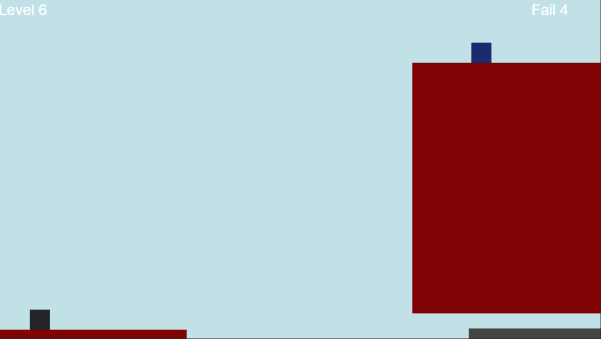
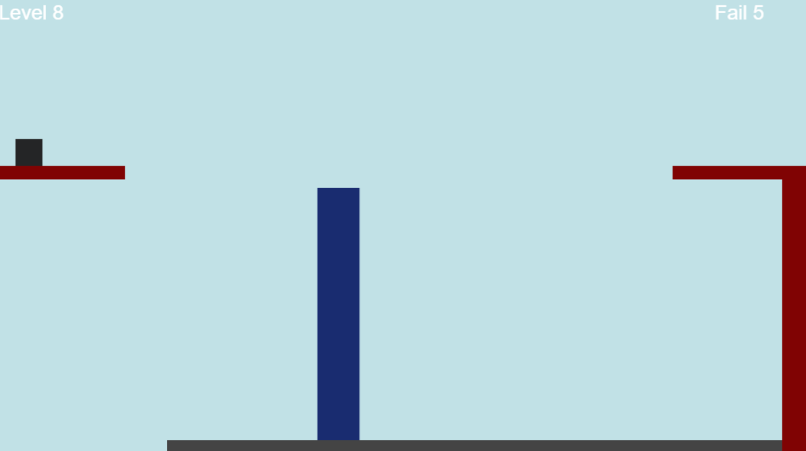

Cube Game JavaScript ve HTML5 Canvas kullanılarak geliştirilmiş bir 2D platform oyunudur.

Oyuncunun bir veya iki adet küpü kontrol ettiği bu oyunda 10 adet bölümde bulunan engelleri çeşitli yollarla aşmaya çalışmaktadır. Temel mekanik küplerin kendini büyütüp küçültebilmeleridir.
Küpler platformlarda büyüyerek veya küçülerek ilerlemeye çalışır.

🎮 Oynanış Mekanikleri

Şekil Değiştirme: Karakterin yüksekliğini veya genişliğini değiştirme özelliği. Bu özellik sayesinde dar alanlardan geçme veya yüksek platformlara ulaşma mümkün olur.

Çift Karakter Sistemi: Oyuncu, iki karakter arasında geçiş yaparak bulmacaları çözmek veya ilerlemek zorundadır. Her karakter bağımsız konumda bulunur.

Çift Zıplama (Double Jump): Karakterler havadayken bir kez daha zıplayabilir.

Kontrollü Büyüme/Küçülme: Karakterin sadece uygun ortamlarda büyüyebilmesi için çarpışma kontrolleri yapılır. Duvarlara çarparak büyümek engellenir.

Hareket Sınırlamaları: Belirli bölümlerde (örneğin seviye 4) büyüme engellenebilir – "sağa doğru büyüme yasak" gibi kurallar uygulanır.

Ses ve Müzik

Arka Plan Müziği: Oyun boyunca sırayla dönen iki adet müzik parçası.

Ses Efektleri: Zıplama, yürüme, düşme (ölüm) ve seviye geçiş sesleri.

Müzik Kontrolü: M tuşu ile müziği başlatma/durdurma özelliği.

Kontroller:
Zıplama                  -> W - ↑ - SPACE   
Sola yürüme              -> A - ←
Sağa yürüme              -> D - →
Karakter Değiştirme      -> Q
Büyüme Yönü Değiştirme   -> E
Büyüme                   -> Mouse Tekeri Yukarı
Küçülme                  -> Mouse Tekeri Aşağı
Müziği Durdurma/Başlatma -> M

Kopyaladığım Oyun : Scaling Cubey / https://sventomasek.itch.io/scaling-cubey
Oyunda Kullanılan Müzikler : 
William Tell - Overture
Julius Fucik - Entry of the Gladiators
Ses efektlerini aldığım site : https://craftpix.net

